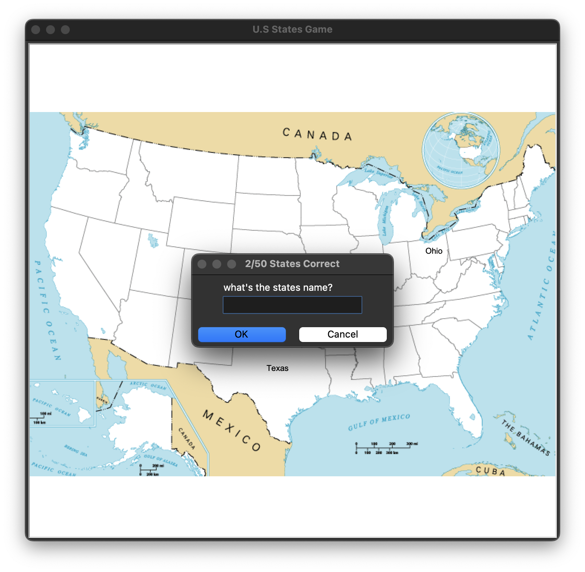

# 🇺🇸 50 States Map Quiz Game 🧠

## 👋 About the Project

Test your **U.S. geography mastery** with this fun, interactive Python game\! The challenge is simple: a map of the United States pops up, and you must correctly name all 50 states.

This project is a classic beginner to intermediate Python exercise, demonstrating how to combine **data processing (Pandas)** with **basic GUI (Turtle)** to create an engaging application.

## ✨ Features You'll Love

  * **Interactive Guessing:** A persistent input box prompts you to enter state names.
  * **Visual Feedback:** Correct guesses instantly appear on the map at the state's exact location.
  * **Progress Tracker:** See your score increase in real-time as you populate the map.
  * **📚 Personalized Study Guide:** Can't name them all? When you **type `Exit`** to quit, the game automatically generates a **`missing_states.csv`** file listing only the states you missed. Perfect for future studying\!

## 🚀 Get Started

### Prerequisites

Before running the game, ensure you have **Python 3** installed. You'll need the following libraries, which are conveniently listed in the `requirements.txt` file.

```bash
# Verify Python installation
python --version
```

### Installation & Run

1.  **Clone the repository:**
    ```bash
    git clone https://github.com/dharsan19/U.S-states-game.git
    cd U.S-states-game
    ```
2.  **Install dependencies:**
    Use `pip` to install the required libraries (like `pandas`):
    ```bash
    pip install -r requirements.txt
    ```
3.  **Launch the game:**
    ```bash
    python main.py
    ```

A new window will open with the map, and the guessing prompt will appear. Good luck\! 🎯

## 🎮 How to Play

1.  A prompt window will appear. Type the full name of any U.S. state (e.g., "**Texas**" or "**Ohio**").
2.  If correct, the state name is drawn onto the map.
3.  Keep guessing until you reach 50/50\!
4.  To stop the game at any time, simply type **`Exit`** into the input box. Your score will be final, and your study guide will be created.

## 💻 Tech Stack

| Technology | Icon | Purpose |
| :--- | :--- | :--- |
| **Python** | 🐍 | The core language for game logic. |
| **Pandas** | 🐼 | Efficiently reading and managing coordinate data from `50_states.csv`. |
| **Turtle** | 🐢 | Handling the graphical window, displaying the map image, and writing text. |
| **CSV** | 📊 | Storing initial data and exporting your personalized `missing_states.csv` study list. |

## 📸 Screenshots


